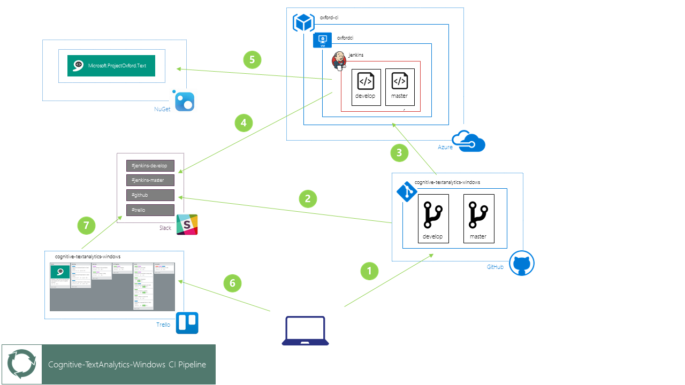

# Text Analytics API: CI Pipeline

Below is a diagram and description of the continuous integration (CI) pipeline used by the project.

1. Developer pushes changes from local git repo to GitHub.

2. GitHub sends a notification of the push to oxford-hq #github channel on Slack.

3. GitHub initiates a build on the Jenkins CI server via a webhook.

4. Jenkins sends build status updates to the appropriate #jenkins channel for the oxford-hq Slack team.

5. Upon a successful build, Jenkins creates a publishes a NuGet packate to the appropriate source (MyGet for the develop branch, NuGet for the master branch).

6. Upon a successful build, Jenkins push generated documentation to the oxford-docs GitHub repo.

7. The oxford-docs repo is pushed to an Azure web app.

8. Developer updates work items on the Cognitive-TextAnalytics-Windows Trello board.

9. Trello sends a notification of the work item update to oxford-hq #trello channel on Slack.
