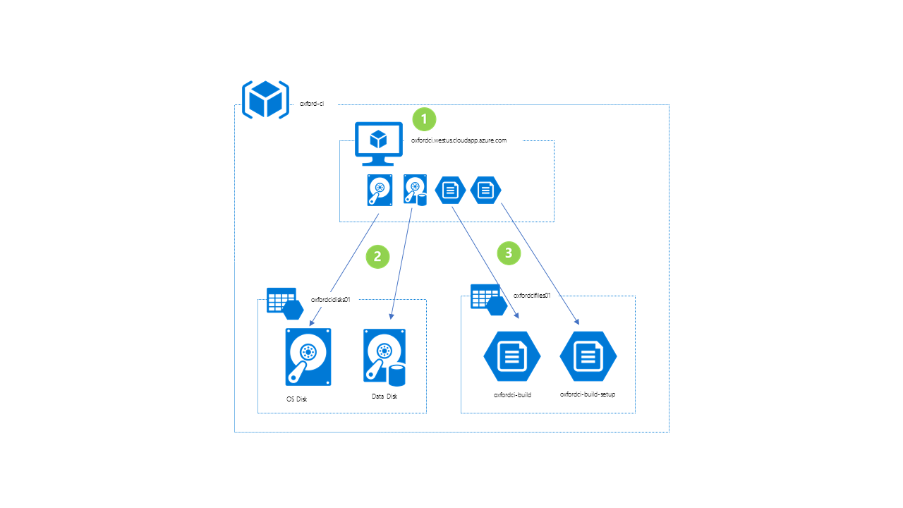

# Text Analytics API: CI Server

Below is a diagram and description of the continuous integration (CI) server used by the project.

1. **Virtual machine** (*oxfordci.westus.cloudapp.azure.com*)
  * *Series:* DSv2
  * *Size:* DS1 (1 core, 3.5 GB memory)
  * *OS:* Windows Server 2016 Datacenter
  * *Software Installed:*
    * Git
    * Java 8
    * Jenkins
    * Microsoft Azure SDK
    * Microsoft Azure PowerShell
    * Microsoft Build Tools 2015
    * Sandcastle Help File Builder

2. **Premium storage account** (*oxfordcidisks01*) - Used for the virtual machine's OS and data disk.

3. **Standard storage account** (*oxfordcifiles01*) - Used to host file shares that contain build tools and build output.
