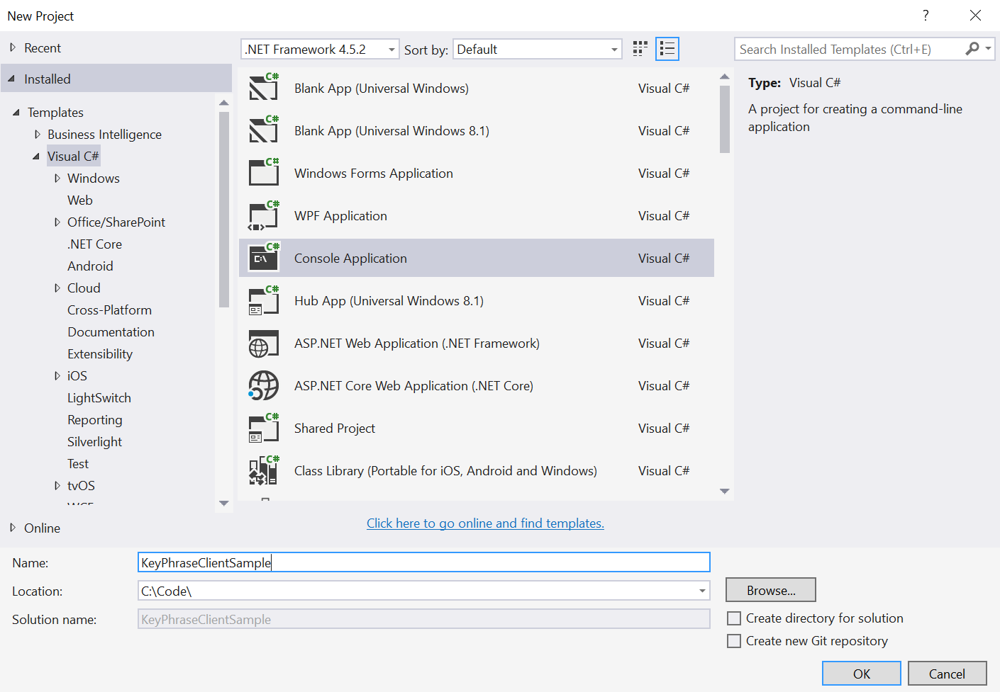
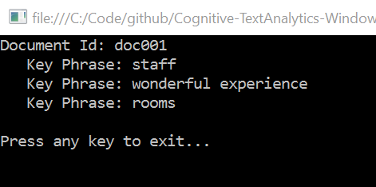

# Using the Client Library's KeyPhraseClient class

In order to use the client library's `KeyPhraseClient` class, you must obtain a Text API subscription key by following these [instructions](/getting-started.md).

1. Start Microsoft Visual Studio 2015 and select `File > New > Project`.

2. Create a new `C# Console Application`.

    

3. Open the `Package Manager Console` and install the [Text API Package](https://www.nuget.org/packages/Microsoft.ProjectOxford.Text/) from NuGet.

    `PM> Install-Package Microsoft.ProjectOxford.Text`

4. Open the `Program.cs` file, and add the following `using` statement to the top of the file.

      ```cs
      using Microsoft.ProjectOxford.Text.KeyPhrase;
      ```
5. Add the following code to the `Main` method, replacing the default value with you Text Analytics API subscription key.

  ```cs
  var apiKey = "YOUR-TEXT-ANALYTICS-API-SUBSCRIPTION-KEY";
  ```

6. Below the code you just added, create a new `KeyPhraseDocument` object that contains a unique id and the text you want to use for key phrase detection.

  ```cs
  var document = new KeyPhraseDocument()
  {
      Id = "YOUR-UNIQUE-ID",
      Text = "YOUR-TEXT",
      Language = "en"
  };
  ```

7. After the `KeyPhraseDocument` is created, create a new `KeyPhraseRequest` object and add the `KeyPhraseDocument` to it.

  ```cs
  var request = new KeyPhraseRequest();
  request.Documents.Add(document);
  ```

8. Once the request is created, create a new `KeyPhraseClient` object, using the Text Analytics API subscription key specified above.

  ```cs
  var client = new KeyPhraseClient(apiKey);
  ```

9. Call the `KeyPhraseClient`'s `GetKeyPhrases` method using the `KeyPhraseRequest` object created earlier.

  ```cs
  var response = client.GetKeyPhrases(request);
  ```

  _Alternatively you can declare the `Main` method as `async` and call the `GetKeyPhrasesAsync` method with the following code._

  ```cs
  var response = await client.GetKeyPhrasesAsync(request);
  ```

10. Process the `Response` object to display the results.

  ```cs
  foreach (var doc in response.Documents)
  {
      Console.WriteLine("Document Id: {0}", doc.Id);

      foreach (var keyPhrase in doc.KeyPhrases)
      {
          Console.WriteLine("   Key Phrase: {0}", keyPhrase);
      }
      Console.WriteLine();
  }
  ```

11. You should see something similar to the following.

  

## Complete Code Listings
- [`KeyPhraseClient` (sync)](CodeListings/04-keyphrase-client-sync.md)
- [`KeyPhraseClient` (async)](CodeListings/04-keyphrase-client-async.md)

## Developer Code of Conduct
Developers using Cognitive Services, including this client library & sample, are required to follow the “[Developer Code of Conduct for Microsoft Cognitive Services](http://go.microsoft.com/fwlink/?LinkId=698895)”.
