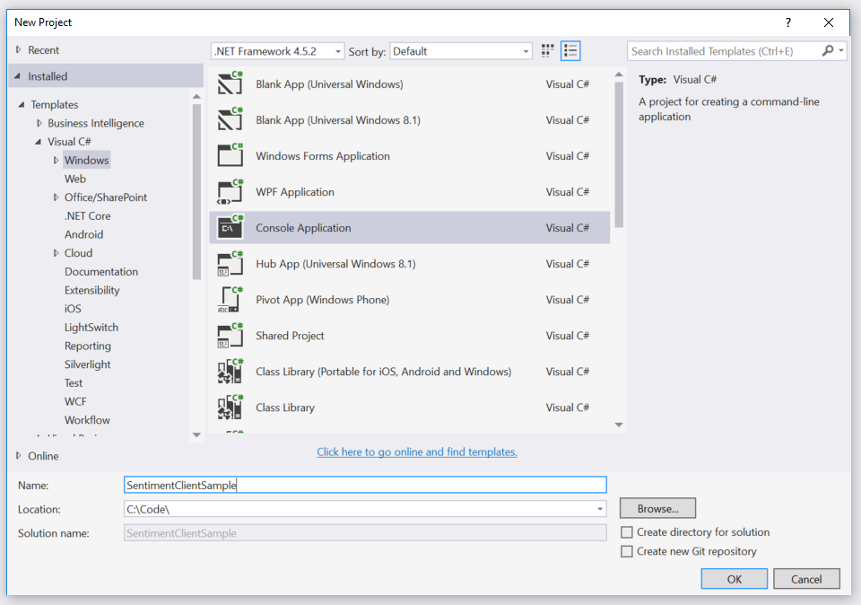
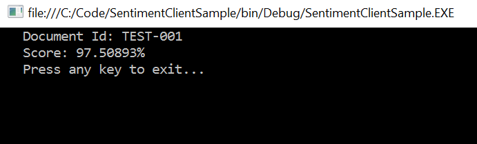

# Using the Client Library's SentimentClient class

In order to use the client library's `SentimentClient` class, you must obtain a Text API subscription key by following these [instructions](/getting-started.md).

1. Start Microsoft Visual Studio 2015 and select `File > New > Project`.

2. Create a new `C# Console Application`.

    

3. Open the `Package Manager Console` and install the [Text API Package](https://www.nuget.org/packages/Microsoft.ProjectOxford.Text/) from NuGet.

    `PM> Install-Package Microsoft.ProjectOxford.Text`

4. Open the `Program.cs` file, and add the following `using` statement to the top of the file.

  ```cs
  using Microsoft.ProjectOxford.Text.Sentiment;
  ```

5. Add the following code to the `Main` method, replacing the default value with you Text Analytics API subscription key.

  ```cs
  var apiKey = "YOUR-TEXT-ANALYTICS-API-SUBSCRIPTION-KEY";
  ```

6. Below the code you just added, create a new `SentimentDocument` object that contains a unique and the text you want to use for language identification.

  ```cs
  var document = new SentimentDocument()
  {
    Id = "YOUR-UNIQUE-ID",
    Text = "YOUR-TEXT",
    Language = "en"
  };
  ```

7. After the `SentimentDocument` is created, create a new `SentimentRequest` object and add the `SentimentDocument` to it.

  ```cs
  var request = new SentimentRequest();
  request.Documents.Add(document);
  ```

8. Once the request is created, create a new `SentimentClient` object, using the Text Analytics API subscription key specified above.

  ```cs
  var client = new SentimentClient(apiKey);
  ```

9. Call the `SentimentClient`'s `GetSentiment` method using the `SentimentRequest` object created earlier.

  ```cs
  var response = client.GetSentiment(request);
  ```

  _Alternatively you can declare the `Main` method as `async` and call the `GetSentimentAsync` method with the following code._

  ```cs
  var response = await client.GetSentimentAsync(request);
  ```

10. Process the `Response` object to display the results.

  ```cs
  foreach(var doc in response.Documents)
  {
      Console.WriteLine("   Document Id: {0}", doc.Id);
      Console.WriteLine("   Score: {0}%", (doc.Score * 100));
  }
  ```

11. You should see something similar to the following.

  

## Complete Code Listings
- [`SentimentClient` (sync)](CodeListings/03-sentiment-client-sync.md)
- [`SentimentClient` (async)](CodeListings/03-sentiment-client-async.md)

## Developer Code of Conduct
Developers using Cognitive Services, including this client library & sample, are required to follow the “[Developer Code of Conduct for Microsoft Cognitive Services](http://go.microsoft.com/fwlink/?LinkId=698895)”.
