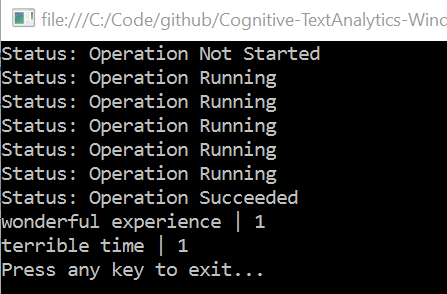

# Using the Client Library's TopicClient class

In order to use the client library's `TopicClient` class, you must obtain a Text API subscription key by following these [instructions](/getting-started.md).

1. Start Microsoft Visual Studio 2015 and select `File > New > Project`.

2. Create a new `C# Console Application`.

  

3. Open the `Package Manager Console` and install the [Text API Package](https://www.nuget.org/packages/Microsoft.ProjectOxford.Text/) from NuGet.

  `PM> Install-Package Microsoft.ProjectOxford.Text`

4. Open the `Program.cs` file, and add the following `using` statement at the top of the file.

  ```cs
  using Microsoft.ProjectOxford.Text.Topic;
  ```

5. Add the following code to the `Main` method, replacing the default value with you Text Analytics API subscription key.

  ```cs
  var apiKey = "YOUR-TEXT-ANALYTICS-API-SUBSCRIPTION-KEY";
  ```

6. Below the code you just added, create a new `TopicRequest` object and add at least 100 `TopicDocument` objects that contains a unique id and the text you want to use for topic detection. (_Note: the topic detection API requires request to include at least 100 documents_).

  ```cs
  var request = new TopicRequest();

  for (int i = 1; i <= 100; i++)
  {
      request.Documents.Add(new TopicDocument() { Id = i.ToString(), Text = "YOUR-TEXT" });
  }
  ```

7. Once the request is created, create a new `TopicClient` object, using the Text Analytics API subscription key specified above.

  ```cs
  var client = new TopicClient(apiKey);
  ```

8. Call the `StartTopicProcessing` method to submit the documents for processing.

  ```cs
  var operationUrl = client.StartTopicProcessing(request);
  ```

9. The `StartTopicProcessing` method returns a url that can be used to check on the status of the documents submitted for processing via the `GetTopicResponse` method.

  ```cs
  TopicResponse response = null;
  var doneProcessing = false;

  while (!doneProcessing)
  {
    response = client.GetTopicResponse(operationUrl);

    switch(response.Status)
    {
      case TopicOperationStatus.Cancelled:
          Console.WriteLine("Status: Operation Cancelled");
          doneProcessing = true;
          break;
      case TopicOperationStatus.Failed:
          Console.WriteLine("Status: Operation Failed");
          doneProcessing = true;
          break;
      case TopicOperationStatus.NotStarted:
          Console.WriteLine("Status: Operation Not Started");
          Thread.Sleep(60000);
          break;
      case TopicOperationStatus.Running:
          Console.WriteLine("Status: Operation Running");
          Thread.Sleep(60000);
          break;
      case TopicOperationStatus.Succeeded:
          Console.WriteLine("Status: Operation Succeeded");
          doneProcessing = true;
          break;
    }
  }
  ```

10. Once the documents have processed, use the `Response` object to display the results.

  ```cs
  foreach (var topic in response.OperationProcessingResult.Topics)
  {
      Console.WriteLine("{0} | {1}", topic.KeyPhrase, topic.Score);
  }
  ```
11. You should see something similar to the following.

  

## Complete Code Listings
- [`TopicClient` (sync)](CodeListings/05-topic-client-sync.md)
- [`TopicClient` (async)](CodeListings/05-topic-client-async.md)

## Developer Code of Conduct
Developers using Cognitive Services, including this client library & sample, are required to follow the “[Developer Code of Conduct for Microsoft Cognitive Services](http://go.microsoft.com/fwlink/?LinkId=698895)”.
