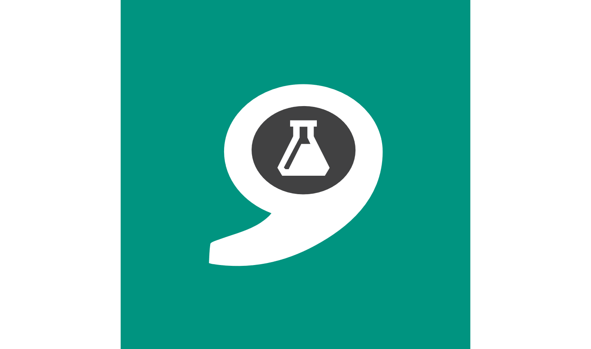
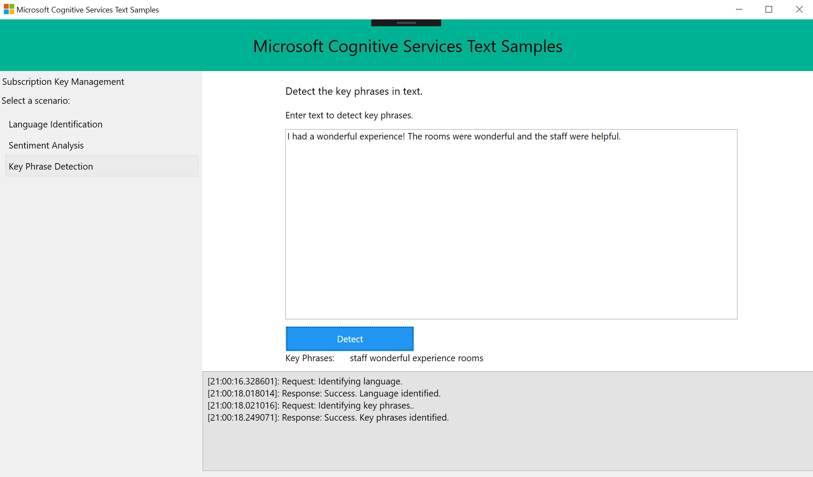

# Text Analytics API: Windows Client Library & Sample
Text Analytics API is a suite of text analytics services built with Azure Machine Learning and offers APIs for sentiment analysis, key phrase extraction and topic detection for English text, as well as language detection for 120 languages.

The solution contains the SDK and a sample application that allows you to enter your API key and text to perform the following actions:
- Language identification
- Sentiment analysis **_(coming soon)_**
- Key phrase detection **_(coming soon)_**
- Topic detection **_(coming soon)_**

## The Client Library
The client library is a thin C\# client wrapper for Microsoft Text Analytics API. The easiest way to use this client library is to get microsoft.projectoxford.text package from [nuget](http://nuget.org).

Please go to the [Text API Package in Nuget](https://www.nuget.org/packages/Microsoft.ProjectOxford.Text/) for more details.

## The Sample
This sample is a Windows WPF application to demonstrate the use of Text Analytics API. It demonstrates the following:
- Language identification
- Sentiment analysis **_(coming soon)_**
- Key phrase detection **_(coming soon)_**
- Topic detection **_(coming soon)_**

### Build the Sample
1. Starting in the folder where you clone the repository (this folder)
2. In a git command line tool, type `git submodule init` (or do this through a UI)
3. Pull in the shared Windows code by calling `git submodule update`
4. Start Microsoft Visual Studio 2015 and select `File > Open > Project/Solution`.
5. Go to `Sample-WPF Folder`.
6. Double-click the Visual Studio 2015 Solution (.sln) file TextAPI-WPF-Samples.
7. Press Ctrl+Shift+B, or select `Build > Build Solution`.

### Run the Sample
After the build is complete, press F5 to run the sample.

First, you must obtain a Text API subscription key by following these [instructions](Docs/01-getting-started.md).

Locate the text edit box saying "Paste your subscription key here to start" on the top right corner. Paste your subscription key. You can choose to persist your subscription key in your machine by clicking "Save Key" button. When you want to delete the subscription key from the machine, click "Delete Key" to remove it from your machine.

Click on "Select Scenario" to use samples of different scenarios, and follow the instructions on screen.

## Contributing
Contributions are welcome. Feel free to file issues and pull requests on the repo and we'll address them as we can. Learn more about how you can help on our [Contribution Rules & Guidelines](/CONTRIBUTING.md).

This project has adopted the [Microsoft Open Source Code of Conduct](https://opensource.microsoft.com/codeofconduct/). For more information see the [Code of Conduct FAQ](https://opensource.microsoft.com/codeofconduct/faq/) or contact [opencode@microsoft.com](mailto:opencode@microsoft.com) with any additional questions or comments.

## License
All Microsoft Cognitive Services SDKs and samples are licensed with the MIT License. For more details, see [LICENSE](/LICENSE.md)

## Developer Code of Conduct
Developers using Cognitive Services, including this client library & sample, are required to follow the “[Developer Code of Conduct for Microsoft Cognitive Services](http://go.microsoft.com/fwlink/?LinkId=698895)”.
